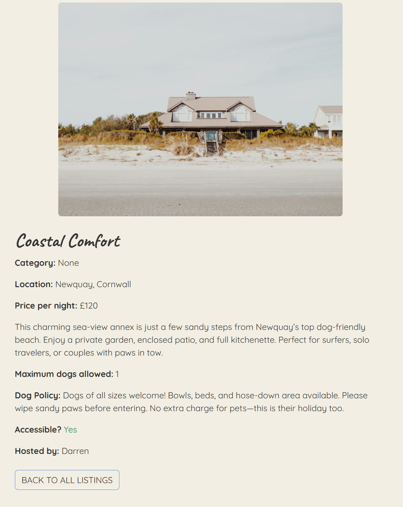
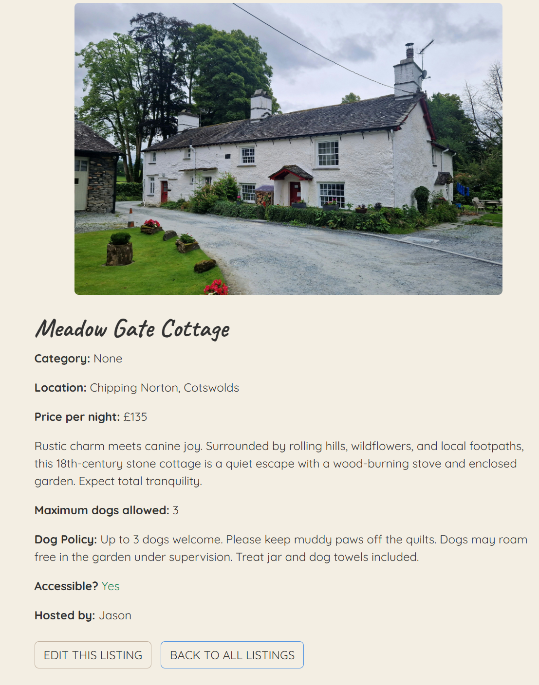

# WoofAway

## Milestone Project 4 - Full Stack Frameworks with Django

- WoofAway is a full-stack Django web application designed to connect dog owners with verified, dog-friendly accommodation providers. The platform allows users to search, book, and review stays that cater specifically to their pets’ needs. At the same time, hosts can register and list their own dog-welcoming properties, manage bookings, and engage with guest feedback.

- The website offers a secure authentication system, a relational database with CRUD functionality for listings and bookings, and e-commerce integration via Stripe to process payments. With a clear user-focused interface, WoofAway aims to deliver a seamless, pet-conscious travel experience while demonstrating strong full-stack development practices in line with professional web application standards.

- This is my Milestoine Project 4 submission for Code Institutes Diploma in Web Application Development Course.

## Project Link

To access my website please click this [link]()

## Repository

To access my repository please click this [link](https://github.com/FraserR1188/WoofAway)

## Project Goals

The primary goal of WoofAway is to create a user-friendly, full-stack Django web application that meets the practical needs of dog owners seeking pet-friendly accommodation, while also providing a streamlined way for hosts to list and manage their properties.

# Table of Contents

## Contents

- [User Stories](#user-stories)
  - [Guest/Logged In User](#guest--logged-in-user-customer-looking-to-book)
  - [Host](#host-dog-friendly-property-owner)
  - [Website Owner](#website-owner-admin-of-the-platform)
- [Design](#design)
  - [Overview](#overview)
  - [Colour Scheme](#colour)
  - [Typography](#typography)
  - [Imagery](#imagery)
  - [Icons](#icons)
  - [Wireframes](#wireframes)
- [Features](#features)
  - [Navigation Bar](#navigation-bar)
  - [Hero Image](#hero-image)
  - [Main Section](#main-sections)
  - [Footer](#footer)
  - [Sign Up Flow](#sign-up-page)
  - [Login Page](#login-page)
  - [Forgotten Password Flow](#user-password-resetforgotten-password)
  - [Profile](#profile)
  - [Listings](#listings)
  - [About](#about)
  - [Host Dashboard](#host-dashboard)
  - [Booking/Payment Flow](#bookingpayment-flow)
  - [Reviews](#review)
  - [Messaging Service](#messaging-service)
- [Future Features](#future-features)
- [Data Model](#data-model)
- [Technologies Used](#technologies-used)
  - [Languages Used](#languages-used)
  - [Frameworks Libraries and Programs](#frameworks-libraries-and-programs)
- [Testing](#testing)
- [Deployment](#deployment)
- [Code](#code)
- [Content](#content)
- [Media](#media)
- [Acknowledgements](#acknowledgements)

## User Stories

### Guest / Logged-in user (Customer looking to book)

- As a guest / logged-in user, I want to be able to register and log in so I can book listings and leave reviews.
- As a guest / logged-in user, I want to be able to view detailed listing pages so I can see pet-friendly features, photos and price.
- As a guest / logged-in user, I want to be able to make a secure booking so I can reserve a place for my trip.
- As a guest / logged-in user, I want to be able to pay for my trip easily.
- As a guest / logged-in user, I want to be able to recieve a booking confirmation so I know my booking is successful.
- As a guest / logged-in user, I want to be able to cancel a booking in case I change my mind.
- As a guest / logged-in user, I want to be able to leave a review so I can share my experiences with others.
- As a guest / logged-in user, I want to be able to view my bookings dashboard so I can keep track of my trips.
- As a guest / logged-in user, I want to be able to edit my account info in case they change for any reason.

### Host (Dog-friendly property owner)

- As a host, I want to register for a host account so I can list my dog-friendly accomomdation.
- As a host, I want to create a new listing so I can offer my home for bookings
- As a host, I want to edit or delete my listing so I can keep my information up-to-date
- As a host, I want to view bookings for my listing so I can manage who is staying at my place
- As a host, I want to prevent overlapping bookings so my property isn’t double-booked
- As a host, I want to respond to guest reviews so I can engage with guest feedback

### Website Owner (Admin of the platform)

- As a website owner, I want to access the Django admin panel so I can manage users, listings, and reviews
- As a website owner, I want to remove inappropriate listings or reviews so I can maintain platform safety and quality
- As a website owner, I want to view site-wide statistics or data so I can monitor usage or improve performance

## Design

### Overview

I want the design of the website to super easy to read and navigate. Simplistic design with smooth edges is what I have in mind. The name "WoofAway" implies what the website wants to achieve. It's clean, friendsly and repsonsive design inspired by Airbnb which is tailored for dog owners and hosts. The fonts which are select show a qurky yet understandable and legible.

### Colour

### Typography

The fonts which I have picked are the playful Caveat for headings, logos and testimonials and the modern Quicksand font for body text, nav and buttons. Caveat adds a more personal feel and friendly feel and Quicksand is clear and easliy read.

### Imagery

The images which will be present on the website will be the logo for WoofAway and the pictures of the houses on the listings. The host will be able to upload them. A profile picture of the host can aslo be uploaded but not necessary.

### Icons

I used the Font Awesome icons for the social links which are present throughout the website in the footer.

### Wireframes

Mobile Wireframe

Tablet Wireframe

Desktop Wireframe

# Features

## Home Page

### Navigation Bar

- This is what the navigation bar looks like when no one is logged in.

- This is the nav bar when a user is logged in.

- This the nav bar when the host or a normal user uses the dropdown menu to select their profile of bookings.

- This is the nav bar in a mobile view one when nothing is selected and the other when the burger menu has been touch.

- This is the host view on the mobile view.

### Hero Image

- This is the hero image on the home page.

- These are home page buttons which take the user to the listings page or if they have an account/host then they can create a listing. The BROWSE LISTING button has been highlighted to show the animation effect.

### Main Sections

- These are the main section headings on the home page which give good reason to choose this service. All links take the user to the section of the website intended.

### Footer

- This is the footer which is present throughout the website. It contains a button which take the user to sign-up page if not already signed up. there also Font Awesome icons taking the user to the correct social media outlets.

### Sign Up Page

- I've test data in the screenshot to show how it looks.

- This is the process how someone would sign up to the website.
- After the user has input the information, they then recieve an email into the inbox.

- The email in the users inbox should look something like this.

- Once the user has clicked on the link it should transport them back to the site to confirm.

- Once confirmed, the user is then taken the login page to them start exploring the site with a user account.

### Login Page

### User Password Reset/Forgotten Password

- If the user has forgotten their password as warning will pop up.

- User clicks on forgotten password, they then have to put their email in.

- The user should then checked their email.

- THIS NEEDS MOREEOEOEOEOEO

### Profile

- This is what the profile looks like before the user edits it.

- These are the fields which need to be filled in. When the user ticks being a host this enables them to create a listing. Otherwise, they will not have that option.

- This is an exmaple of the profile edit before being filled. It gives the user an option to upload an image of themselves.

- This shows an image of the user also the Host? showing green. If they were not a host then it would be grey and saying no.

### Listings

- This is the listings landing page. Since this user is a host the green button "CREATE NEW LISTING" is showing.

- This is the page with the listing detail. I made sure that there was a link to the host's profile so that the guest will feel more comfortable with their staying. Feeling like they've already met the host.

- This is what a normal user will see. The view will change for a host which created the listing.

- These are the editable fields on the listing. The creation and editing screens are the same page. All fields from the custom model are present and the host can select up to 20 dogs to stay.

- If the user decides to delete their listing this modal pops up to confirm.

### About

- I thought it might be nice to have an About page to give a better understanding to the website. The picture which is shown was prepared by myself.

- This explains the goals of the website.

- This introduces the people behind the website and a snazzy Accordion with more information.

### Host Dashboard

- This section is only available to Hosts as it shows the current status of any booking they may have.

- It give the host complete control over their bookings. The host can carry out the following actions if they desire. The confirm button will confirm the booking but not pay for it as only the guest can do this. The may needed on a special requirement basis e.g. family staying...

- This modal will confirm the booking but not pay for it.

- This modal will cancel the booking.

### Booking/Payment Flow

- This will be example of the booking/payment flow.

- This button, which is located underneath any reviews which may be present on the listing, will initiate the booking process.

- The reserve screen allows the user to select dates in a fun, easy way. It also asks the user how many dogs they will bring. The number is set by the host who sets a limit when the listing is created. The number of dogs is then sent in a email when the payment has been authorised.

- Once the booking has been created the user is then taken to a summary where they have a number of options.

- This is to show that there is some sort of defense against an incorrect credit card number

- Once the correct details have been inputted the user is then notified and a basic email is sent to both the guest and the host.

- This confirmed information is always accessible to the guest and the host via the host dashboard. The information will also be present via email. I like the fact the host and guest have a close, transparent realtionship throughout the process.

- Sometimes the guest can't always pay there and then so once the booking has been reserved it will stay on there bookings waiting to be paid. It also gives them the option to edit or cancel the booking.

- From this same section, the user can leave a review. This review section is available only when the guest has paid. For testing purposes I had to see if it works but future development I would make it so it becomes active after the stay.

### Review

- This is where the guest can leave a 1-5 star rating and a comment.

- From a user perspective.

- This gives the guest a chance to delete or edit their review.

- Via the home, there's a way to go through all the reviews which are present on the site.

- Once a booking is made, as mentioned before, the guest can interact with the host via a messaging service. This is incase the guest has any questions to ask the host on stuff which hasn'e been mentioned in the listing description. Again, I thought this was a nice, user-friendly feature.

- The messaging service can be used through the My Booking, and then selecting the booking which will be taking place. The message can then be picked up from the nav-bar and then through the inbox.

### Messaging Service

- This is the conversation flow.

- This is what is looks like with a conversation present.

- No conversations.

### 404

If the user goes tries to put an invalid url on the website this 404 page pops up and redirects the user to the home page.

# Future Features

### Cateogories / Search

- The categories dropdown is available but due to time contraints I couldn't finish it. I would also implement a search functionality with key words.

### Host Availability Calendar & Sync

- An interactive calendar which let hosts block out dates (vacations, personal time) so guests always see real availability. Also intergrate with Google Calender and iCal so host/guest don't have to double-enter.

### Profile & Listing Verification

- Superhost” badge which will automatically grant after a host hits a threshold of bookings, positive reviews, and response rate. ID verification that offers optional or mandatory host/guest ID checks for extra trust (e.g. via a third-party service).

### Richer Messaging Experience

- Attachments and photos which let users share images (e.g. of the dog’s favorite toy) or PDF waivers for signature. Read receipt that shows when a message has been seen.

# Data Model

## Considerations

- WoofAway keeps authentication and profile data separate: we use Django’s built-in User for login credentials and permissions, and a one-to-one UserProfile for bio, picture, host flag, address, and accessibility fields. Listings reference their host, include key pet-friendly details (price, max dogs, dog policy, accessibility), and link to a simple Category lookup table for consistent filtering.

- Each Booking ties a guest and a listing to a date range, enforces valid check-in/check-out rules in the form, calculates total_price automatically, and includes a status field to track pending, confirmed, or cancelled stays. Payments are stored in their own model related 1:1 to a Booking so we can record Stripe intent IDs, handle retries or webhooks, and keep financial data separate from reservation logic.

- Reviews live in a small table linking users to listings with a 1–5 star rating and comment; we enforce one review per completed stay at the application level. Messaging is built around a Conversation model (two participants + listing) with an associated Message table for individual chat entries—this separation makes it easy to later add attachments or group threads.

- All foreign-key relationships use cascading deletes to keep orphaned records out of the database, and critical lookups (e.g. bookings by host or guest, reviews by listing) are indexed by default in Django. This design strikes a balance between normalization (no duplicated fields), clarity of cardinality, and room for future growth—whether adding amenities, implementing calendar exclusion constraints for bookings, or archiving old data.
  Easy Extensibility: Add more profile fields (social links, preferences) without touching auth tables.

[View my database schema here](docs/README/ERD%20WoofAway.png)

# Technologies Used

## Languages Used

- [HTML5](https://en.wikipedia.org/wiki/HTML5)

- [CSS3](https://en.wikipedia.org/wiki/CSS)

- [JavaScript](https://en.wikipedia.org/wiki/JavaScript)

- [Python](<https://en.wikipedia.org/wiki/Python_(programming_language)>)

## Frameworks Libraries and Programs

- [Heroku](https://id.heroku.com/login)

  - Heroku is the deployment source I used for this project. I'm also using it for the Postgres relational database

- [Django](https://www.djangoproject.com/)

  - I used this full-stack framework to create my website.

- [Jinja](https://jinja.palletsprojects.com/en/3.0.x/)

  - Templating language I've used with Python to add logic to my html templates.

- [Google Fonts](https://fonts.google.com/)

  - Two fonts are imported from google fonts.

- [Font awesome](https://fontawesome.com/)

  - I used icons from font awesome on social media icons on the footer.

- [Git](https://git-scm.com/)

  - Git was used as a version control in the terminal.

- [Github](https://github.com/)

  - Github was used to create and store the project repository.

- [Google Chrome Dev Tools](https://developer.chrome.com/docs/devtools/)

  - Google Chrome's Dev Tools were used while building the project to test responsiveness and for debugging.

- [DrawSQL](https://drawsql.app/)

  - I used DrawSQL for creating my database schema.

- [VS Code](https://code.visualstudio.com/)

  - VS Code was my IDE throughout this project.

- [flatpickr](https://flatpickr.js.org/)

  - Used for the calender when the guest reserves their booking.

- [Bootstrap 5](https://getbootstrap.com/)

  - I used this for my front-end design with HTML, CSS, JS. I used features including Nav bar, Cards, Buttons and Forms.

- [Unsplash](https://unsplash.com/)

  - I used this site for all the images.

- [Stripe](https://stripe.com/gb)

  - I used Stripe as the payment system in this website.

# Testing

- Please refer [here](TESTING.md) for more information on testing of the WoofAway website

# Deployment

- Please refer [here](DEPLOYMENT.md) for more information on testing of the WoofAway website

# Code

- Code Institute: I referred to lessons and source code from Code Institute's Web Application Development course. I sourced the CRUD functionality on how to set up the database using the walkthrough. As well as understanding the Stripe payment system.

- Bootstrap: I used this library throughout the project. Particularly for the nav bar, cards, forms and buttons.

- Documentation: I referred to the documentation provided by [Django](https://docs.djangoproject.com/en/5.2/) and also [Python](https://www.python.org/doc/).

- YouTube: Visiual tutorials on how cloud computing works to understand AWS better for the uploading of images to S3 Buckets. the documentation from Amazon also helped.

# Content

- [AirBnb](https://www.airbnb.co.uk/) I used this site as inspiration but I tried to make my website feel more personal.

# Media

- I sourced all the pictures from [Unsplash](https://unsplash.com/).

# Acknowledgements

- Many thanks to my mentor Mikto for guiding me the way with heplful feedback and recommended tools.
- Thank you to the tutors and staff at Code Institute for their support.
- I really appreciate the people who I work with as it provided a wide testing base.

Please note this is a personal project. This website is purely for the sake of the developer's portfolio and not for public consumption.

Robbie Fraser, 2025
