# Testing

WoofAway website has been tested using the following methods:

- [Code Validation](#code-validation)
  - [W3C HTML Validator](#w3c-html-validator)
  - [W3C CSS Validator](#w3c-css-validator)
  - [JSHint Validator](#jshint)
- [Accessibility](#accessibility)
  - [WAVE Webaim Accessibility Checker](#wave-webaim-accessibility-checker)
- [Google Lighthouse](#google-lighthouse)
  - [Home Page](#home-page)
  - [About Page](#about-page)
  - [Listing Page](#listing-page)
  - [Listing Detail Page](#listing-detail-page)
- [Browser Compatibility](#browser-compatibility)
  - [Responsiveness](#responsivenss)
- [Testing User Stories](#testing-user-stories)
  - [Guest / Logged In User](#guest--logged-in-user-customer-looking-to-book)
  - [Host](#host-dog-friendly-property-owner)
  - [Website Owner](#webiste-owner-admin-of-the-platform)
- [Manual Testing Table](#manual-testing-table-for-woofaway)
- [Peer Review](#peer-review)
- [Bugs](#bugs)
- [Unresolved](#unresolved)

# Code Validation

## W3C HTML Validator

- WoofAway has passed using the [W3C HTML Validator](https://validator.w3.org/) tool.

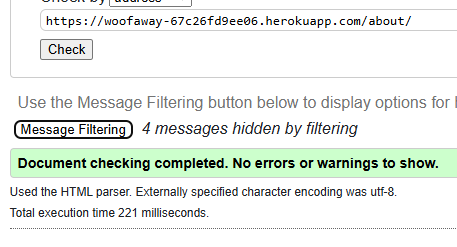

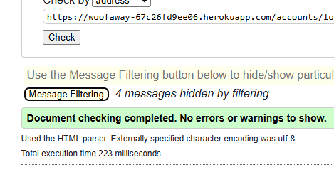

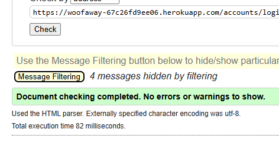

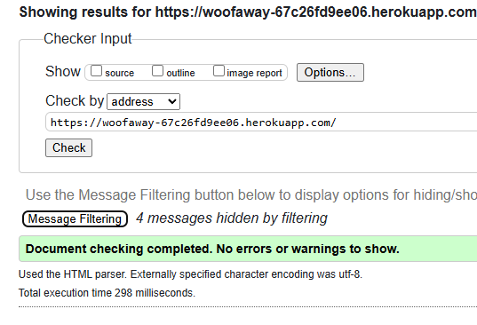

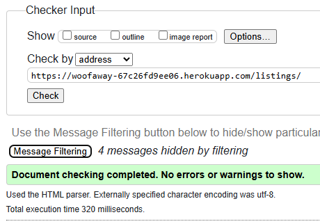

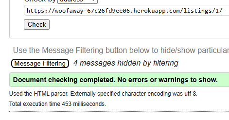

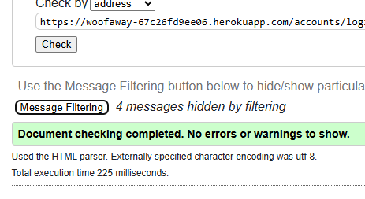

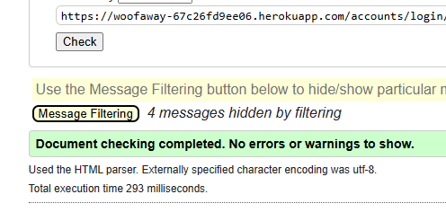

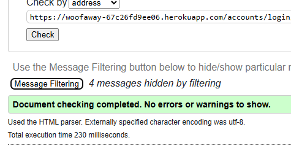

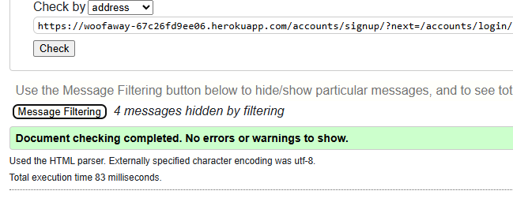

## W3C CSS Validator

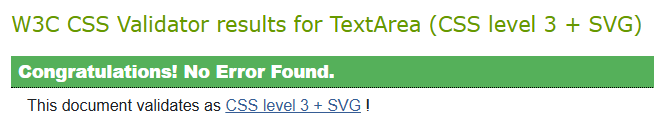

- WoofAway website has passed using [W3C CSS Validator](https://jigsaw.w3.org/css-validator/) tool.

## JSHint

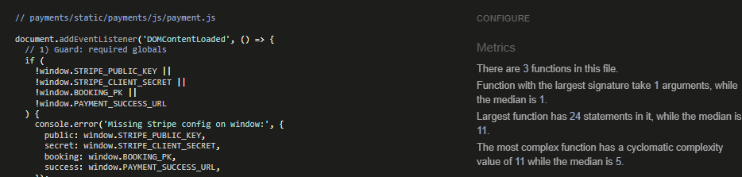

- WoofAway website passed all tests using JSHint Validator tool.

## Accessibility

### WAVE Webaim Accessibility Checker

- The was tested on the home page for accessibility using [WAVE Webaim](https://wave.webaim.org/) an no serious issues found. Contrast error was over the transparent image and the errors were emoty links which had icons in them.

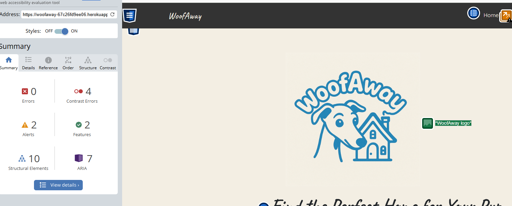

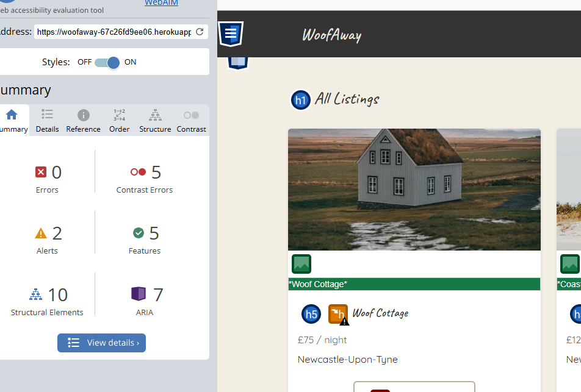

## Google Lighthouse

I used the Lighthouse reports in Google Developer Tools to examine the pages of the website for the following

- Performace
- Accessibility
- Best Practices
- SEO

The first result will be desktop, second will be mobile.

### Home Page

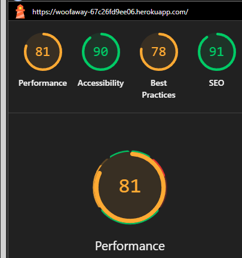

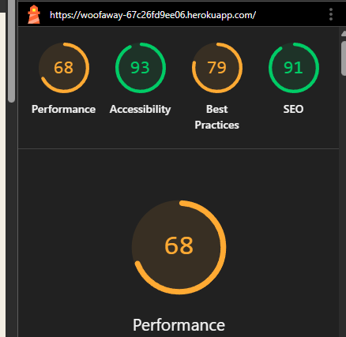

### About Page

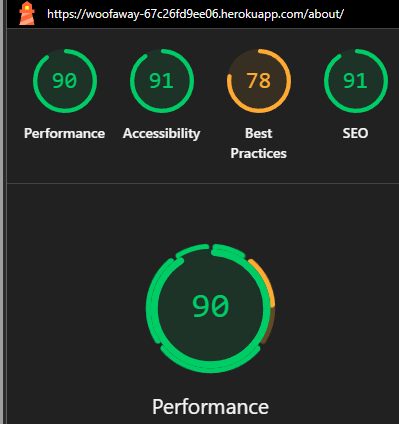

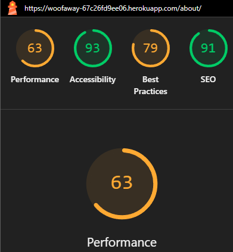

### Listing Page

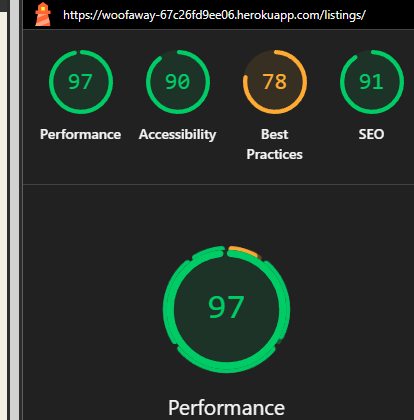

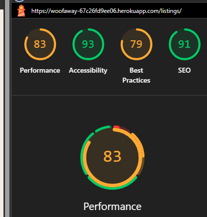

### Listing Detail Page

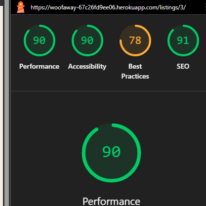

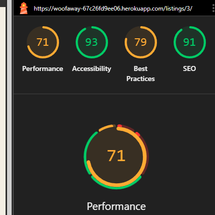

## Browser Compatibility

The site was tested on Google Chrome, Opera, Mozilla Firefox and Microsoft Edge on the Desktop.

The site was tested on Safari and Google Chrome on mobile.

The site was tested on Safari on iPad.

Timeout issues arose when testing when user were inactive. This may be an issue with Heroku hosting site as there were no issues present on the logs.

## Responsivenss

Responsivity tests were carried out using Google Chrome DevTools. Device screen sizes covered include:

- iPhone SE
- iPhone XR
- iPhone 12 Pro
- Pixel 5
- Samsung Galaxy S8+
- Samsung Galaxy S20 Ultra
- iPad Mini
- iPad Air
- Surface Pro 7
- Surface Duo
- Galaxy Fold
- Samsung Galaxy A51/71
- Nest Hub
- Nest Hub Max

I also personally tested the website on iPhone 13, iPhone 11 and MSI gaming PC with a dual screen.

# Testing User Stories

### Guest / Logged-in user (Customer looking to book)

- As a guest / logged-in user, I want to be able to register and log in so I can book listings and leave reviews.
  - I can register and log in so I can book listings and leave reviews.
- As a guest / logged-in user, I want to be able to view detailed listing pages so I can see pet-friendly features, photos and price.
  - I can view detailed listing pages, including pet-friendly features, photos, and prices.
- As a guest / logged-in user, I want to be able to make a secure booking so I can reserve a place for my trip.
  - I can make a secure booking to reserve a place for my trip.
- As a guest / logged-in user, I want to be able to pay for my trip easily.
  - I can pay for my trip easily using integrated Stripe payments.
- As a guest / logged-in user, I want to be able to recieve a booking confirmation so I know my booking is successful.
  - I receive booking confirmations once the payment succeeds or the booking is confirmed by the host.
- As a guest / logged-in user, I want to be able to cancel a booking in case I change my mind.
  - I can cancel a booking from my dashboard if I change my mind.
- As a guest / logged-in user, I want to be able to leave a review so I can share my experiences with others.
  - I can leave reviews for listings I’ve stayed at, and edit or delete my review later.
- As a guest / logged-in user, I want to be able to view my bookings dashboard so I can keep track of my trips.
  - I can view a bookings dashboard showing upcoming, confirmed, or cancelled trips.
- As a guest / logged-in user, I want to be able to edit my account info in case they change for any reason.
  - I can edit my account/profile information, including bio, city, country, and profile picture.

### Host (Dog-friendly property owner)

- As a host, I want to register for a host account so I can list my dog-friendly accomomdation.
  - I can register for an account and become a host to list my dog-friendly property.
- As a host, I want to create a new listing so I can offer my home for bookings
  - I can create a new listing with title, location, price, accessibility, dog policy, and max dogs.
- As a host, I want to edit or delete my listing so I can keep my information up-to-date
  - I can edit or delete my listings to keep my offerings up-to-date.
- As a host, I want to view bookings for my listing so I can manage who is staying at my place
  - I can view all bookings made for my listings with clear status labels (pending, confirmed, cancelled).
- As a host, I want to respond to guest reviews so I can engage with guest feedback
  - I can respond to guest reviews, allowing engagement and transparency.

### Webiste Owner (Admin of the platform)

- As a website owner, I want to access the Django admin panel so I can manage users, listings, and reviews.
  - I can access the Django admin panel to manage all users, listings, reviews, and payments.
- As a website owner, I want to remove inappropriate listings or reviews so I can maintain platform safety and quality.
  - I can moderate and remove inappropriate listings or reviews via the admin interface.
- As a website owner, I want to view site-wide statistics or data so I can monitor usage or improve performance.
  - I can view site-wide data and statistics using Django admin tools or custom dashboard views for oversight.

# Manual Testing Table for WoofAway

| Test ID | Feature                           | Precondition                          | Steps                                                                                                                                                                       | Expected Result                                                                                                                                            | Pass/Fail |
| ------: | --------------------------------- | ------------------------------------- | --------------------------------------------------------------------------------------------------------------------------------------------------------------------------- | ---------------------------------------------------------------------------------------------------------------------------------------------------------- | :-------: |
|   MT-01 | Registration & Email Verification | Logged out                            | 1. Go to Sign Up. 2. Enter valid username, email, password twice. 3. Submit. 4. Check inbox for verification email. 5. Click verification link. 6. Attempt log in.          | Account created; verification email received; link activates account; login succeeds.                                                                      |    ✅     |
|   MT-02 | Password Reset                    | Registered user, logged out           | 1. Click “Forgot Password?” on login page. 2. Enter registered email. 3. Submit. 4. Check inbox; click reset link. 5. Set new password. 6. Log in with new password.        | Reset email received; reset page accepts new passwords; login with new password succeeds; old password rejected.                                           |    ✅     |
|   MT-03 | Login Invalid Credentials         | Logged out                            | 1. Attempt login with incorrect password or unverified account. 2. Submit.                                                                                                  | Appropriate error message displayed; login denied.                                                                                                         |    ✅     |
|   MT-04 | Listing Creation (Host)           | Logged in as Host                     | 1. Navigate to Create Listing. 2. Fill in title, description, location, price, max dogs, dog policy, accessibility, image. 3. Submit.                                       | Listing appears in list; detail page shows all data accurately; host sees Edit and Delete buttons.                                                         |    ✅     |
|   MT-05 | Listing Edit/Delete Permissions   | Logged in as non-owner / owner        | A. As non-owner, attempt to access /edit/ or /delete/ URL. B. As owner, edit details and save. C. As owner, delete listing and confirm modal.                               | A. Non-owner sees 404 or redirect with error; B. Changes saved and visible; C. Listing removed and redirect to listing list.                               |    ✅     |
|   MT-06 | Booking Date Validation           | Logged in as Guest                    | 1. Select booking start date after end date. 2. Submit form with invalid range. 3. Select past dates. 4. Submit.                                                            | Validation errors for date order and past dates; booking not created.                                                                                      |    ✅     |
|   MT-07 | Booking & Payment Flow            | Logged in as Guest, listing available | 1. Click Book Now. 2. Select valid date range and number of dogs within host limit. 3. Submit booking. 4. On payment page, enter invalid card then valid card. 5. Complete. | Booking created with pending status; invalid card shows error; valid payment confirms status, sends emails to guest and host, redirects to booking detail. |    ✅     |
|   MT-08 | Booking Cancellation (Guest)      | Pending booking exists, logged in     | 1. Go to My Bookings. 2. Click Cancel button. 3. Confirm in modal. 4. Refresh page.                                                                                         | Modal appears; booking status updated to Cancelled; no further payment allowed; cancellation email (if enabled).                                           |    ✅     |
|    MT-9 | Host Booking Management           | Host user, bookings exist             | 1. Go to Host Dashboard. 2. Click Confirm on pending booking; cancel another. 3. Verify modals. 4. Check status updates.                                                    | Confirm modal appears; booking status updates to Confirmed; cancel modal appears; status Cancelled; guest sees updated status email/notifications.         |    ✅     |
|   MT-10 | Reviews Submission & Permissions  | Completed & paid booking              | 1. After stay, navigate to listing detail. 2. Submit 1–5 star review with comment. 3. Attempt to review same listing twice. 4. Edit and delete review.                      | Review form available only after completed stay; review appears; duplicate submission prevented; edit/delete reflect on listing and dashboard.             |    ✅     |
|   MT-11 | Profile Editing & Host Toggle     | Logged in                             | 1. Go to Profile. 2. Edit bio, address, upload image, toggle Host. 3. Save and revisit.                                                                                     | Profile updates persisted; toggling host flag shows/hides Create Listing on home page.                                                                     |    ✅     |
|   MT-12 | Messaging Host/Guest              | Guest & host with shared booking      | 1. Guest clicks Message Host on booking page. 2. Send a message. 3. Host opens Inbox, views, and replies. 4. Guest checks inbox.                                            | Conversation created once; messages displayed with timestamp and correct bubble styling; participants only see their conversation(s).                      |    ✅     |
|   MT-13 | Navigation & Responsiveness       | Various devices / screen sizes        | 1. Navigate to site on desktop, tablet, mobile. 2. Open nav menu, user dropdown, modals. 3. Perform booking flow on mobile.                                                 | Navbar collapses correctly; dropdown and modals usable on all viewports; flows complete without UI breakage.                                               |    ✅     |
|   MT-14 | Admin Panel Moderation            | Admin user                            | 1. Log in to Django admin. 2. Locate a listing and review. 3. Delete inappropriate entry. 4. Verify removal on front end.                                                   | Admin can delete or edit any user, listing, review; changes reflect immediately on front-end; non-admin cannot access admin.                               |    ✅     |

## Peer Review

- This project was sent to my team at work within the NHS. All feedback was positive and everyone enjoyed both sections of website apart from on some bigger phones users had to scroll up and down to target all the cards. From this feedback I have decreased the size of the cards on a higher max-width media query to ensure all user's have a fluid gameplay experience.
- My family and friends have also tested the project and have given positive feedback.

## Bugs

Confirmation-email branding issue. Allauth was still using [example.com] in your email subjects. Fixed by setting ACCOUNT_EMAIL_SUBJECT_PREFIX = "[WoofAway] " (or via Django Admin).

Password-reset “NoReverseMatch”. My override of password_reset_from_key.html had an explicit  action, but Allauth no longer exposes uidb36 so the URL lookup failed. Switched the form to simply <form method="post"> so it posts back to the same /reset/key/.../ route.

Password-change error messages hidden. The custom “Change Your Password” template only showed a generic banner (“Please correct the error below.”) and never rendered the actual validator messages. Updated the template to loop through form.non_field_errors and each field.errors, so you now see why (too short, mismatch, numeric-only, etc.).

max_dogs not showing on the “Create/Edit Listing” form. I added max_dogs to the model but forgot to switch your view to use form_class = ListingForm (with the new field/widget). Once the CreateView/UpdateView used your custom form, the dropdown appeared as expected.

No field for “number of dogs” in Booking. The booking model only included dates and price. Guests couldn’t tell hosts how many dogs they’d bring. Added a num_dogs field to Booking, surfaced it on the listing form, and validated it against the host’s max_dogs.

Profile detail showed request.user instead of target user. On /profile/<pk>/, you were still rendering {{ request.user.email }} and {{ request.user.username }} even if you’d loaded someone else’s profile. Switched to {{ profile.user.email }}/{{ profile.user.username }} and only show the “Edit Profile” button when request.user == profile.user.
